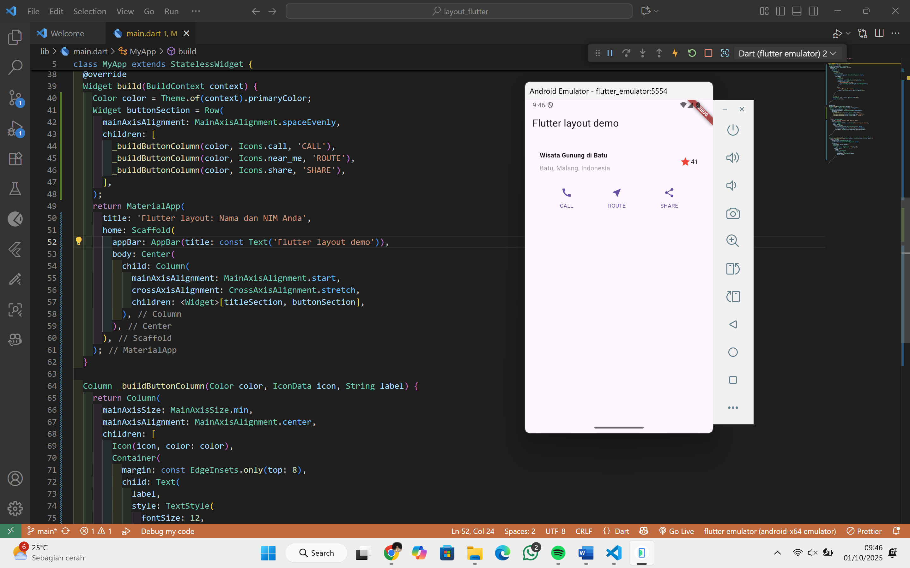

# layout_flutter

Flutter project layout.

## Praktikum 1: Membangun Layout di Flutter

## Praktikum 2: Implementasi button row

## Praktikum 3: Implementasi text section

## Praktikum 4: Implementasi image section

Untuk laporan Praktikum bisa di lihat di sini
[laporan Praktikum Jobsheet 5 (PDF)](https://drive.google.com/file/d/1ggNm2Ee7qICLcRB5ZpKRYgIjoltO_Krh/view?usp=sharing)

